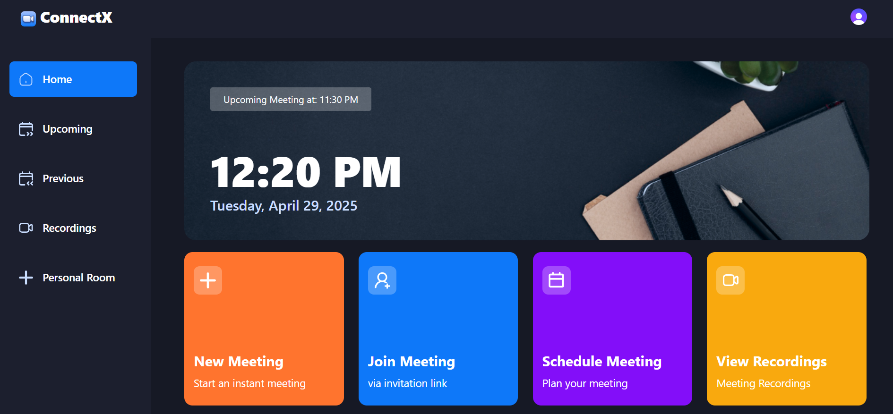
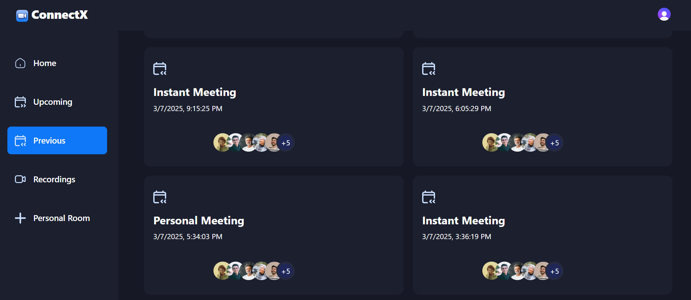
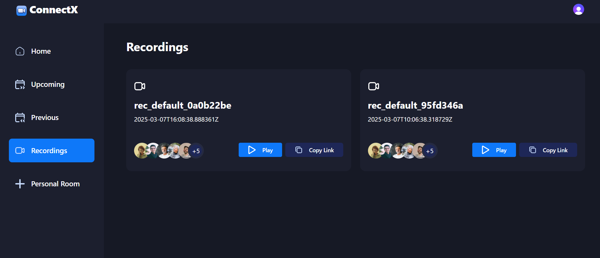
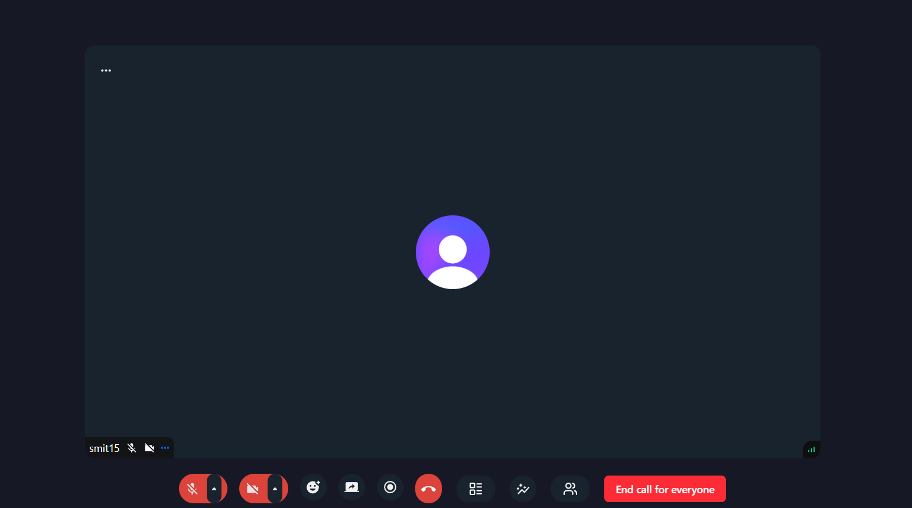
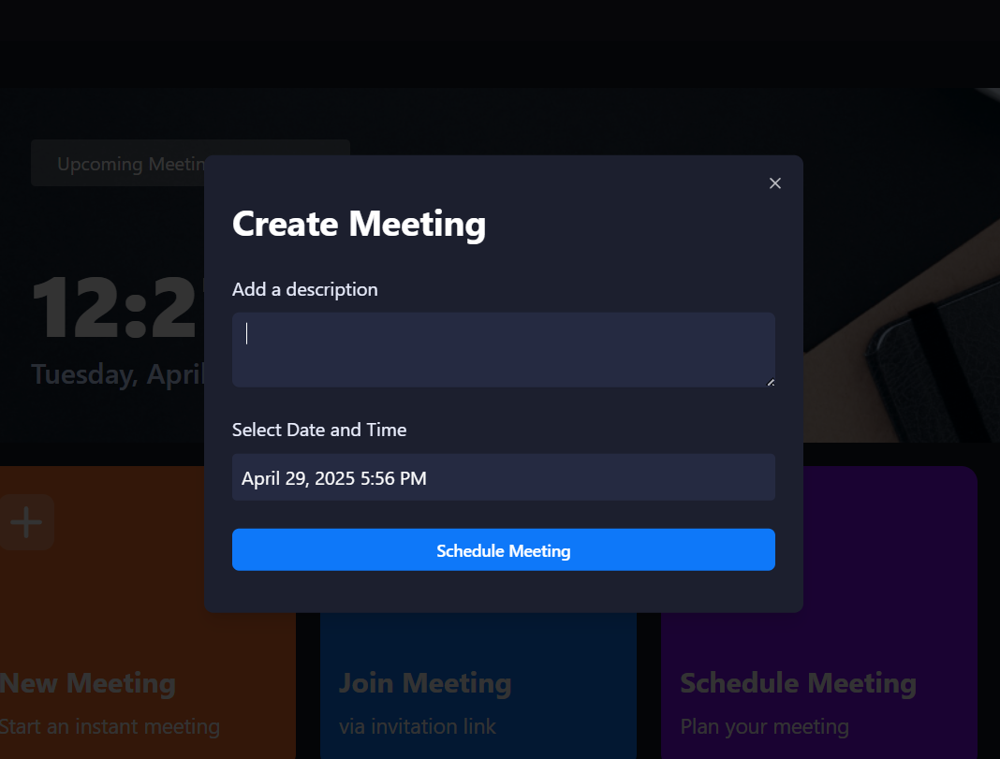
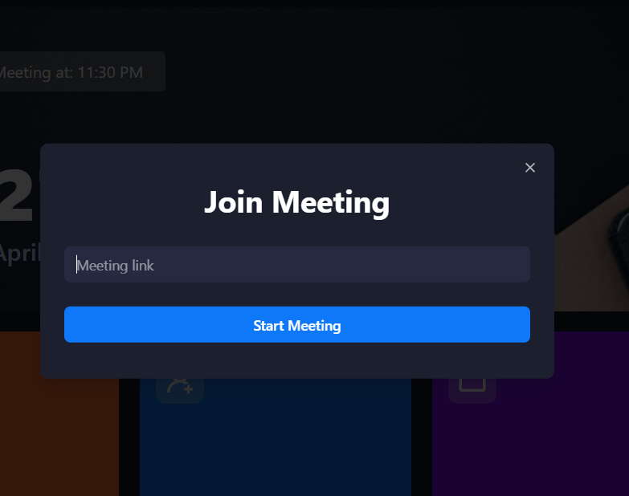

<h1 align="center">🌐 ConnectX 🌐</h1>
 

## Create Meetings 📅

- Users can schedule and create meetings.

## Invite Others 📩

- Users can send invitations to others via a specific meeting link.

## Screen Recording 🎥

- Users can record the screen during the meeting.

## Share Recordings 🔄

- After the meeting, the recording is shared with those who missed it.

## Meeting History 📜

- Users can view a history of all past meetings.

  

# Website Preview

 

       

       

       

       

       

       

